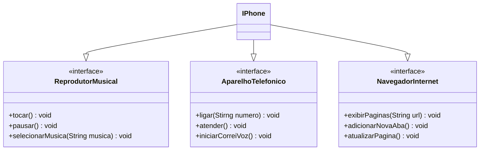

# ☕ POO - Desafio

## 👨🏾‍💻 Autor 

- [Caio Gomes Silva](https://github.com/CaioSilva584)

## 📝 Descrição
Este reposittório contém a realização do desafio da trilha do bootcamp [Santander 2024 - Backend com Java](https://web.dio.me/track/santander-2024-backend-com-java)

## 📈 Diagrama de classes
A seguir, é apresentado o diagrama de classes desenvolvido utilizando a sintaxe [mermaid](https://mermaid.js.org/intro/getting-started.html):



## 💻 Código
A seguir, são apresentados os códigos referentes a cada classe e inrterface desenvolvidas na IDE [Eclpise](https://eclipseide.org/), utilizando a [versão 17](https://www.oracle.com/java/technologies/javase/jdk17-archive-downloads.html) do JDK:

### Interface ReprodutorMusical
```java

package com.iphone.interfaces;

public interface ReprodutorMusical {
	public void tocar ();
	public void pausar ();
	public void selecionarMusica (String musica);
}


```

### Interface AparelhoTelefonico
```java

package com.iphone.interfaces;

public interface AparelhoTelefonico {
	public void ligar (String numero);
	public void atender ();
	public void iniciarCorreioVoz();
}

```

### Interface NavegadorInternet
```java

package com.iphone.interfaces;

public interface NavegadorInternet {
	public void exibirPaginas (String url);
	public void adicionarNovaAba ();
	public void atualizarPagina ();
}


```

### Classe IPhone
```java

package com.iphone.model;

import com.iphone.interfaces.AparelhoTelefonico;
import com.iphone.interfaces.NavegadorInternet;
import com.iphone.interfaces.ReprodutorMusical;

public class IPhone implements ReprodutorMusical, AparelhoTelefonico, NavegadorInternet {
	@Override
	public void tocar() {
		// TODO Auto-generated method stub
		System.out.println("Tocando música");
	}
	@Override
	public void pausar() {
		// TODO Auto-generated method stub
		System.out.println("Música pausada");
	}
	@Override
	public void selecionarMusica(String musica) {
		// TODO Auto-generated method stub
		System.out.println("Faixa " + musica + " selecionada");
	}
	
	@Override
	public void ligar(String numero) {
		// TODO Auto-generated method stub
		System.out.println("Ligando para " + numero);
	}
	@Override
	public void atender() {
		// TODO Auto-generated method stub
		System.out.println("Alô?");
	}
	@Override
	public void iniciarCorreioVoz() {
		// TODO Auto-generated method stub
		System.out.println("Correio de voz iniciado");
	}
	
	@Override
	public void exibirPaginas(String url) {
		// TODO Auto-generated method stub
		System.out.println("Acessando " + url);
	}
	@Override
	public void adicionarNovaAba() {
		// TODO Auto-generated method stub
		System.out.println("Abrindo nova página");
	}
	@Override
	public void atualizarPagina() {
		// TODO Auto-generated method stub
		System.out.println("Atualizando página");
	}
}

```

### Classe Acesso, contendo a rotina `main`
```java

package com.iphone.aplic;

import com.iphone.model.IPhone;

public class Acesso {
	public static void main(String[] args) {
		IPhone celNovo = new IPhone();
		
		//Reprodutor
		celNovo.selecionarMusica("Before I forget");
		celNovo.tocar();
		celNovo.pausar();
		
		//Telefone
		celNovo.ligar("1599100-5385");
		celNovo.atender();
		celNovo.iniciarCorreioVoz();
		
		//Navegador
		celNovo.adicionarNovaAba();
		celNovo.exibirPaginas("https://github.com/CaioSilva584");
		celNovo.atualizarPagina();
	}
}

```